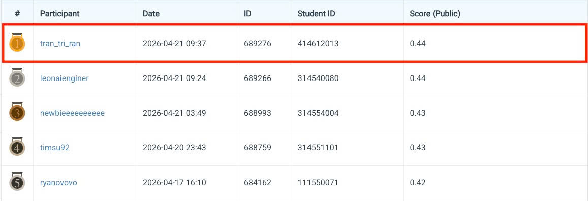

# NYCU CV2026 HW2 — Digit Detection

**Course:** NYCU Selected Topics in Visual Recognition (CV2026) — Homework 2  
**Student:** Tran Khanh Nhan  
**Student ID:** 414612013

---

## 1. Introduction

**Task:** 10-class digit detection (0–9) using DETR-family architectures. Backbone weights are initialised from pretrained ImageNet checkpoints; no pretrained DETR weights are used.

This repository benchmarks two DETR-family detectors for digit detection:

| Method | Key Idea |
|---|---|
| **DINO** | DN-DETR variant with contrastive de-noising, multi-scale deformable attention, and optional EMA |
| **AlignDETR** | Progressive one-to-many assignment via `MixedMatcher` to align training and inference distributions |

### Data Processing

A multi-stage pipeline is applied before training:

- **Quality filtering** — removes dark, blurry, or near-duplicate images.
- **Class-balanced augmentation** — random flip, multi-scale resize (480–800 px, max 1333), `RandomCrop`, targeting ≥ 30 000 instances per class.

### Models & Backbones

| Architecture | Backbone | Pre-training |
|---|---|---|
| DINO | `resnet50.a1_in1k` | ImageNet-1k |
| DINO | `seresnextaa101d_32x8d.sw_in12k_ft_in1k_288` | ImageNet-12k → ImageNet-1k |
| AlignDETR | `resnet50.a1_in1k` / `resnet101` / `seresnextaa101d` | ImageNet-1k / ImageNet-12k |

All backbones use **FrozenBatchNorm2d** and a 4-level **ChannelMapper** neck (256 channels).

### Loss Functions & Optimisation

- **Sigmoid Focal Loss** for classification (α=0.25, γ=2).
- **GIoU + L1** for bounding-box regression.
- **Hungarian Matcher** with cost weights (class 2, bbox 5, giou 2).
- **MixedMatcher (AlignDETR)** — progressive one-to-many assignment; `match_num=[2,2,2,2,2,2,1]`, `tau=1.5`.
- **Contrastive de-noising (DINO)** — `dn_number=100`, `label_noise_ratio=0.5`, `box_noise_scale=1.0`.
- **AdamW** — `lr=1e-4`, `weight_decay=1e-4`, backbone LR × 0.1, gradient clipping `max_norm=0.1`.
- **LR schedule** — linear warmup (1 000 steps) + MultiStep decay at 75 % and 90 % of total iterations.
- **Model EMA** — enabled for DINO/seresnextaa101d (decay 0.9998, eval-only).

### Post-processing

**batched NMS** — IoU threshold 0.7, top-100 per image.

---

## 2. Environment Setup

### Option A — Conda (recommended)

```bash
conda env create -f environment.yml
conda activate selected-topics
```

### Option B — pip

```bash
pip install -r requirements.txt
```

> **Note:** `detectron2` and `detrex` must be installed from source. The bundled detrex source is located at `configs/detrex/`.

---

## 3. Usage

### 3.1 Training

```bash
# Single-GPU
python train.py \
  --config configs/train/dino/seresnextaa101d_32x8d.sw_in12k_ft_in1k_288/0.yaml \
  --gpu-ids 0

# Multi-GPU
python train.py \
  --config configs/train/dino/seresnextaa101d_32x8d.sw_in12k_ft_in1k_288/0.yaml \
  --gpu-ids 0,1

# Resume from checkpoint
python train.py \
  --config configs/train/dino/seresnextaa101d_32x8d.sw_in12k_ft_in1k_288/0.yaml \
  --gpu-ids 0 \
  --resume
```

Config path convention: `configs/train/<method>/<backbone>/<run_id>.yaml`.  
Checkpoints are written to `checkpoints/<method>/<backbone>/<run_id>/` and logs to `logs/<method>/<backbone>/<run_id>/`.

### 3.2 Inference

```bash
python test.py \
  --config configs/test/dino/seresnextaa101d_32x8d.sw_in12k_ft_in1k_288/0.yaml \
  --gpu-ids 0
```

The submission JSON is written to the `output_file` path specified in the test YAML.

### 3.3 Visualisation (GradCAM + t-SNE)

```bash
python visualize.py \
  --config configs/test/dino/seresnextaa101d_32x8d.sw_in12k_ft_in1k_288/0.yaml \
  --n-images 6 \
  --target-layer backbone.model.layer4 \
  --score-threshold 0.3 \
  --gpu-ids 0
```

| Argument | Description |
|---|---|
| `--config` | Path to test YAML config |
| `--n-images` | Number of images to visualise (default 6) |
| `--target-layer` | Layer name for GradCAM (e.g. `backbone.model.layer4`) |
| `--score-threshold` | Minimum confidence score to display a box |
| `--gpu-ids` | GPU device IDs |

---

## 4. Performance Snapshot

### Leaderboard



> Public leaderboard as of 2026-04-21. **Rank #1** with Score (Public) = **0.44**.

### Experiment Comparison

Val mAP is COCO AP@[0.5:0.95] on the local validation split.

| Method | Backbone | Queries | Batch size | Max iter | LR | AMP | Val mAP |
|---|---|:---:|:---:|:---:|:---:|:---:|:---:|
| DINO | `resnet50.a1_in1k` | 900 | 2 | 100 000 | 1e-4 | ✓ | 46.84 |
| DINO | `seresnextaa101d_32x8d` | 900 | 2 | 75 000 | 1e-4 | ✗ | **52.47** |
| AlignDETR | `resnet50.a1_in1k` | 900 | 2 | 100 000 | 1e-4 | ✓ | 47.93 |
| AlignDETR | `resnet101` | 900 | 1 | 750 000 | 1e-4 | ✗ | 48.12 |
| AlignDETR | `seresnextaa101d_32x8d` | 900 | 1 | 100 000 | 1e-4 | ✗ | 44.35 |

Best single-model result: **DINO + seresnextaa101d_32x8d → 52.47 val mAP**.
