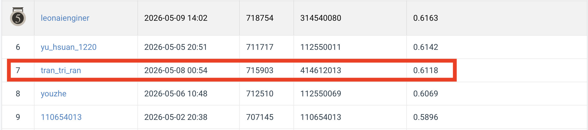

# NYCU CV2026 HW3 — Cell Instance Segmentation
### ***Student:*** Tran Khanh Nhan
### ***Student ID***: 414612013

## 1. Introduction

Flat, function-only implementation of HW3 (4-class cell instance segmentation on
fluorescence-microscopy images, 209 training / 101 test).

This codebase is the same logic as the original project but reorganised:
- Every file sits at the top of the project (no nested `src/` packages).
- All operations are exposed as plain functions; the only classes are the two
  `torch.utils.data.Dataset` wrappers, which are required by the PyTorch DataLoader.

### 1.1 Project layout

```
hw3/
├── train.py              # entry point: training loop
├── test.py               # entry point: inference + COCO submission
├── dataset.py            # CellInstanceDataset + CellTestDataset + loader functions
├── augmentation.py       # Albumentations pipeline + copy-paste + oversampling
├── models.py             # backbone / FPN / RPN / cascade / HTC factories
├── metrics.py            # mask IoU, AP, PR, F1, confusion matrix
├── visualization.py      # all chart functions + save_all_charts()
├── io_utils.py           # image, JSON, RLE, checkpoint, train/val split helpers
├── requirements.txt      # pip dependencies
└── README.md             # this file
```

Expected runtime layout (created by the scripts):

```
data/
├── train/<sample_id>/{image.tif, class1.tif, ..., class4.tif}
├── test_release/*.tif
└── test_image_name_to_ids.json

checkpoints/<model>/<backbone>/<exp>/{last,best}.pth
charts/<model>/<backbone>/<exp>/*.png
logs/<model>/<backbone>/<run_id>.log
submissions/<model>/<backbone>/<exp>/{test-results.json, *.zip, visualize/}
```

### 1.2 Task summary

- 4-class instance segmentation on fluorescence-microscopy images.
- Each training sample is a folder containing `image.tif` plus per-class mask volumes
  `classK.tif` where positive integers encode instance IDs.
- Public CodaBench leaderboard scores AP50; private ranking uses
  COCO mask AP@[0.5:0.95].
- A 200 M-parameter total budget applies to the submitted model.
- Only ImageNet-pretrained backbone weights are permitted; every detection head
  (RPN, three-stage cascade bounding-box heads, mask head(s), and HTC's Fused
  Semantic Head) is trained from scratch.

### 1.3 Method overview

Two cascade-style detectors built on MMDetection 3.x:

| Architecture        | Key idea |
|---------------------|----------|
| Cascade Mask R-CNN  | Three-stage cascade with progressively higher IoU thresholds (0.5 / 0.6 / 0.7) for both bounding-box and mask heads. |
| HTC                 | Cascade Mask R-CNN plus interleaved bbox/mask flow and a Fused Semantic Head that injects pixel-level semantic features into the mask branch. |

Backbones:
- ResNeXt-101 (64 x 4d), open-mmlab ImageNet-1k checkpoint.
- Swin-B (window-7-224, ImageNet-22K).
- Swin-L and ConvNeXt-L are also wired up but exceed the 200 M budget.

Common pipeline:
- 5-level FPN (out_channels = 256), 3-stage cascade RoI head with stage loss
  weights [1.0, 0.5, 0.25].
- Class-balanced WeightedRandomSampler (oversamples rare classes 3 / 4).
- Online copy-paste augmentation with a 3.0x selection bias toward rare classes.
- Inference: score threshold 0.05, NMS IoU 0.5, max 100 detections per image,
  COCO RLE encoding via pycocotools.

### 1.4 References

- MMDetection: https://github.com/open-mmlab/mmdetection
- HTC (Hybrid Task Cascade): https://arxiv.org/abs/1901.07518
- Cascade R-CNN / Cascade Mask R-CNN: https://arxiv.org/abs/1906.09756
- Swin Transformer: https://github.com/microsoft/Swin-Transformer
- Albumentations: https://github.com/albumentations-team/albumentations
- Copy-paste augmentation: https://arxiv.org/abs/2012.07177

## 2. Environment Setup

### 2.1 Conda

```
conda create -n hw3 python=3.10 -y
conda activate hw3

pip install torch==2.2.2 torchvision==0.17.2 \
    --index-url https://download.pytorch.org/whl/cu118
pip install -r requirements.txt
pip install mmdet
```

### 2.2 pip / uv

```
pip install -r requirements.txt
pip install mmdet

# or with uv
uv venv --python 3.10 .venv && source .venv/bin/activate
uv pip install -r requirements.txt
uv pip install mmdet
```

### 2.3 Docker

```
# Use any CUDA-enabled PyTorch base, e.g. pytorch/pytorch:2.2.2-cuda11.8-cudnn8-runtime
docker run --gpus all -it --rm -v "$PWD":/workspace -w /workspace \
    pytorch/pytorch:2.2.2-cuda11.8-cudnn8-runtime bash -lc "
        pip install -r requirements.txt && pip install mmdet &&
        python train.py --config configs/cascade_resnext101.yaml
    "
```

## 3. Usage

### 3.1 Configuration file format

Both `train.py` and `test.py` read a single YAML. Minimal training config:

```yaml
experiment:
  name: v1

model:
  name: cascade_mask_rcnn      # cascade_mask_rcnn | htc
  backbone: resnext101         # resnext101 | swin_b | swin_l | convnext_l
  num_classes: 4
  pretrain_weights:
    path: null                  # null = no extra checkpoint, only backbone init_cfg

data:
  train_dir: data/train
  val_ratio: 0.2
  num_workers: 4
  use_oversampling: true
  augmentation:
    img_size: 1024
    min_scale: 0.5
    max_scale: 2.0
    copy_paste:
      enabled: true
      prob: 0.5
      max_paste: 4
      rare_classes: [4]
      rare_boost: 3.0

training:
  gpu_ids: "0"                  # CUDA_VISIBLE_DEVICES
  device: cuda
  max_epochs: 36
  batch_size: 2
  lr: 0.002                     # SGD; AdamW autodetected for swin/convnext
  weight_decay: 0.0001
  warmup_epochs: 1
  lr_milestones: [24, 32]
  grad_clip: 35.0
  fp16: false

inference:
  score_thr: 0.05
  nms_iou_thr: 0.5

paths:
  base_dir: .
  checkpoint_dir: checkpoints/cascade_mask_rcnn/resnext101/v1
  chart_dir: charts/cascade_mask_rcnn/resnext101/v1
```

Inference YAML differs only in `paths.checkpoint_path` (path to `best.pth`)
and the `data.test_dir` / `data.mapping_json` keys.

### 3.2 Training

```
python train.py --config configs/cascade_resnext101.yaml
python train.py --config configs/cascade_resnext101.yaml --gpu-ids 1
python train.py --config configs/cascade_resnext101.yaml \
    --resume checkpoints/cascade_mask_rcnn/resnext101/v1/last.pth
```

Outputs per run:
- `checkpoints/<model>/<backbone>/<exp>/best.pth` (best validation mask mAP)
- `checkpoints/<model>/<backbone>/<exp>/last.pth`
- `charts/<model>/<backbone>/<exp>/*.png` (loss, AP, PR, F1, confusion matrix, predictions)
- `logs/<model>/<backbone>/<run_id>.log`

### 3.3 Inference / submission

```
python test.py --config configs/cascade_resnext101_test.yaml --gpu_ids 0
python test.py --config configs/cascade_resnext101_test.yaml \
    --checkpoint checkpoints/cascade_mask_rcnn/resnext101/v1/best.pth \
    --score_thr 0.05
```

Submission output is written to:
- `submissions/<model>/<backbone>/<exp>/test-results.json` (COCO mask format)
- `submissions/<model>/<backbone>/<exp>/<exp>.zip` (ready for upload)
- `submissions/<model>/<backbone>/<exp>/visualize/*.png` (overlay PNGs)

### 3.4 Module reference

- `io_utils.py`
  - `load_image_rgb`, `load_tif`, `save_json`, `load_json`
  - `encode_mask_rle`, `decode_mask_rle`
  - `save_checkpoint`, `load_checkpoint`
  - `scan_dir`, `train_val_split`, `stratified_val_split`, `build_output_paths`
- `augmentation.py`
  - `build_train_transform`, `build_val_transform`
  - `copy_paste_augment`, `compute_oversampling_weights`
  - `build_augmentation_pipeline`, `apply_augmentation`
- `dataset.py`
  - Pure functions: `parse_instance_mask`, `load_train_sample`, `normalize_image`,
    `build_source_pool`, `encode_train_item`, `encode_test_item`,
    `get_per_sample_class_counts`
  - Thin `Dataset` wrappers: `CellInstanceDataset`, `CellTestDataset`
- `models.py`
  - Backbone factories: `backbone_resnext101`, `backbone_swin_b`,
    `backbone_swin_l`, `backbone_convnext_l`
  - Common parts: `fpn_neck`, `rpn_head`, `cascade_bbox_stages`,
    `cascade_test_cfg`, `cascade_roi_head`, `htc_roi_head`
  - Top-level: `build_cascade_mask_rcnn`, `build_htc`, `build_model_cfg`,
    `build_mmdet_model`
- `metrics.py`
  - `mask_iou`, `bbox_iou`, `mask_iou_matrix`
  - `compute_ap_from_pr`, `compute_ap_per_class`, `compute_mask_ap_per_class`,
    `compute_map`
  - `compute_pr_per_class`, `compute_confusion_matrix`, `coco_evaluate`
- `visualization.py`
  - `plot_loss_curves`, `plot_all_losses`, `plot_ap_per_class`, `plot_pr_curve`,
    `plot_f1_recall_curve`, `plot_confusion_matrix`, `visualize_predictions`,
    `plot_iou_distribution`, `save_all_charts`
- `train.py`
  - `parse_args`, `setup_logging`, `apply_cli_overrides`, `select_device`
  - `build_optimizer`, `build_scheduler`, `build_dataloaders`
  - `forward_train_batch`, `forward_validate_item`
  - `train_one_epoch`, `validate_one_epoch`, `compute_val_metrics`
  - `save_state`, `maybe_resume`, `save_charts`, `main`
- `test.py`
  - `get_parser`, `load_image_id_mapping`
  - `build_test_model`, `build_test_loader`
  - `predict_image`, `read_image_bgr`, `draw_predictions`, `to_coco_record`
  - `main`

## 4. Performance Snapshot

Public CodaBench leaderboard snapshot (entry `tran_tri_ran`, student ID `414612013`):



| Rank | User         | Submitted          | Submission ID | Score (AP50) |
|------|--------------|--------------------|---------------|--------------|
| 7    | tran_tri_ran | 2026-05-08 00:54   | 715903        | 0.6118       |
