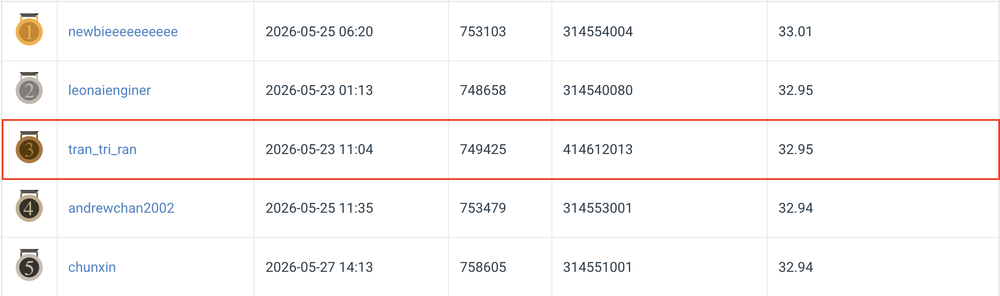
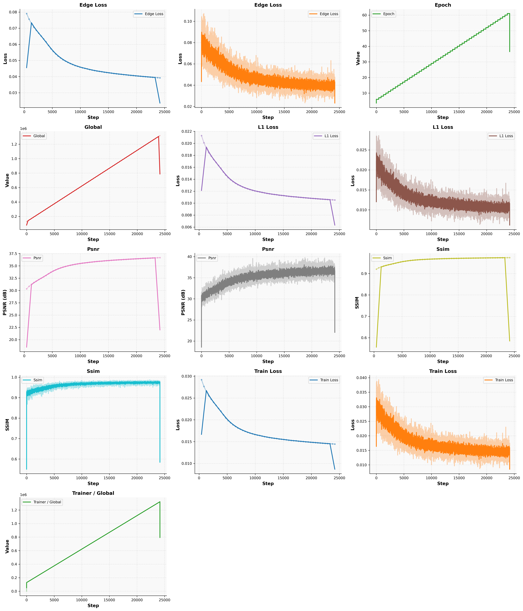
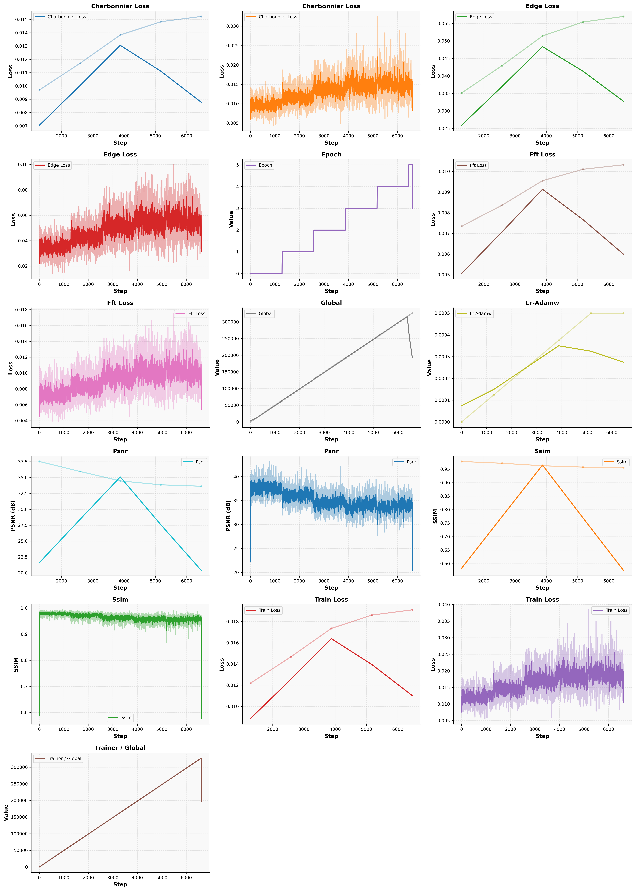
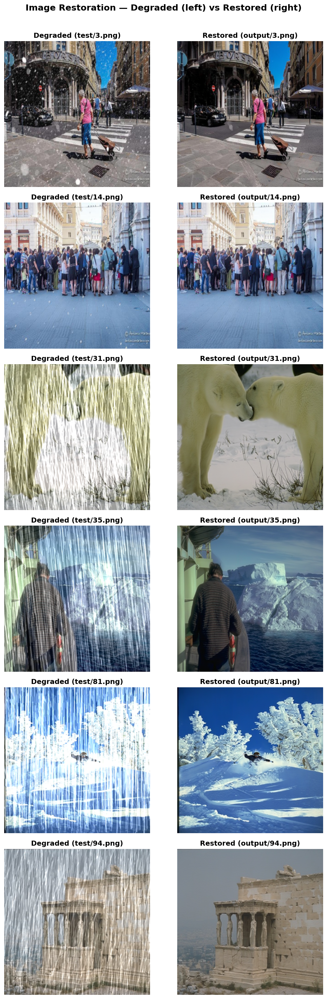

# NYCU CV2026 HW4 - All-in-One Image Restoration

## **Course:** NYCU Selected Topics in Visual Recognition (CV2026) - Homework 4
### ***Student:*** Tran Khanh Nhan
### ***Student ID***: 414612013

---

## 1. Introduction

**Task:** Blind image restoration that removes **rain** and **snow** degradations with a *single* all-in-one model (3 200 train pairs / 100 test images). Submissions are graded on **PSNR** between the restored image and the clean ground truth.

> **One model, two degradations.** A single [PromptIR](https://arxiv.org/abs/2306.13090) network is trained jointly on both rain- and snow-degraded images. The learnable **prompt blocks** in the decoder let one set of weights adapt to the degradation present in each input - no per-task model and no degradation label at test time.

This repository implements and benchmarks **two training recipes** on the same PromptIR backbone:

| Recipe | Script | Key idea |
|---|---|---|
| **v1 - Edge** | [train.py](train.py) | PromptIR + `L1 + 0.1·edge` (Sobel) loss, fp16-mixed, cosine schedule |
| **v2 - Edge+FFT+EMA** | [train_v2.py](train_v2.py) | Charbonnier pixel loss + edge + **FFT amplitude** loss, **EMA** weights, bf16-mixed, gradient clipping |

### Backbone - PromptIR

PromptIR is a 4-level U-shaped Restormer-style transformer (`net/model.py`) with multi-Dconv-head transposed attention (MDTA) and gated-Dconv feed-forward (GDFN) blocks. The decoder is augmented with **prompt-generation / prompt-interaction blocks** that inject a small bank of learnable prompts to condition restoration on the (unknown) degradation type. `decoder=True` enables the prompting path. The same architecture is shared by both recipes and by the inference scripts.

### Data & Augmentation

Raw layout under `data/hw4_realse_dataset/`:

```
train/
  degraded/   rain-*.png , snow-*.png   (3200 degraded inputs)
  clean/      rain_clean-*.png , snow_clean-*.png
test/
  degraded/   0.png … 99.png            (100 degraded inputs, no GT)
```

### Loss Functions

| Term | v1 ([train.py](train.py)) | v2 ([train_v2.py](train_v2.py)) |
|---|---|---|
| Pixel | `L1` (weight 1.0) | **Charbonnier** `√(Δ²+ε²)`, ε=1e-3 (weight 1.0) |
| Edge | Sobel-gradient L1 (weight **0.1**) | Sobel-gradient L1 (weight **0.05**) |
| Frequency | - | **FFT amplitude L1** `‖|F(pred)|−|F(gt)|‖₁` (weight **0.1**) |


### Optimisation

| Setting | v1 | v2 |
|---|---|---|
| Optimizer | AdamW, `lr=2e-4` | AdamW, `lr=2e-4`, `wd=1e-4`, β=(0.9, 0.999) |
| LR schedule | `LinearWarmupCosineAnnealingLR`, warmup 15 / max 150 ep | same, `eta_min=1e-6`, warmup = `min(15, epochs//10)` |
| Precision | `16-mixed` (fp16) | `bf16-mixed` |
| Grad clip | - | `0.5` |
| EMA | - | **shadow weights, decay 0.999** (CPU-pinned, saved as `ema_state_dict`) |
| Checkpoint | best `psnr` (max) | best `psnr_epoch` (max) + `last` |
| Multi-GPU | DDP (`ddp_find_unused_parameters_true`) when >1 GPU | same |

### Test-time Strategy

Both [test.py](test.py) (v1) and [test_v2.py](test_v2.py) (v2) share:

- **8-way self-ensemble TTA** - average predictions over the 8 dihedral transforms (`--self-ensemble`, on by default).
- **Reflection padding** so `H, W` are multiples of 8; optional **overlap-tiling** (`--tile`, tile 128 / overlap 32) for large images.

[test_v2.py](test_v2.py) adds **`--use-ema`** (default on) to load the EMA shadow weights instead of the live weights, falling back gracefully if a checkpoint has none.

---

## 2. Environment Setup

### Option A - Conda (recommended)

```bash
conda env create -f environment.yml
conda activate hw4
```

### Option B - pip

```bash
conda create -n hw4 python=3.10 -y
conda activate hw4

pip install torch torchvision --index-url https://download.pytorch.org/whl/cu118
pip install -r requirements.txt
```

---

## 3. Usage

### 3.1 Pre-processing

Generate the `rain.txt` / `snow.txt` index files consumed by the training dataset:

```bash
python preprocessing.py --data_dir data/hw4_realse_dataset
```

### 3.2 Training

Options are defined in [options.py](options.py); the launcher auto-switches to DDP when more than one GPU is requested.

```bash
# v1 - Edge recipe
python train.py \
    --de_type derain desnow \
    --patch_size 128 --batch_size 6 --epochs 150 \
    --num_gpus 3 \
    --wblogger hw4 --wandb_name RainySnow_edge \
    --ckpt_dir train_ckpt --ckpt_name best_rainsnow_edge
```

```bash
# v2 - Edge + FFT + EMA recipe 
python train_v2.py \
    --de_type derain desnow \
    --patch_size 128 --batch_size 6 --epochs 150 \
    --num_gpus 3 \
    --wblogger hw4 --wandb_name RainySnow_edge \
    --ckpt_dir train_ckpt_v3 --ckpt_name best_rainsnow_edge
```
```bash
# Resume (restores epoch / optimizer / scheduler / EMA)
python train_v2.py --resume train_ckpt_v3/last.ckpt ...
```

```bash
# Fine-tune from weights only (v2)
python train_v2.py --init-from train_ckpt/best_rainsnow_edge.ckpt ...
```

### 3.3 Inference / Test

```bash
# v1
python test.py \
    --checkpoint-path train_ckpt/best_rainsnow_edge.ckpt \
    --test-path data/hw4_realse_dataset/test \
    --output-npz pred.npz --gpu-ids 0
```

```bash
# v2
python test_v2.py \
    --checkpoint-path train_ckpt_v3/best_rainsnow_edge_v2.ckpt \
    --test-path data/hw4_realse_dataset/test \
    --output-npz ./pred_v2.npz --no-use-ema --gpu-ids 0
```

### 3.4 Visualisation

- **Training curves** - every offline wandb run is rendered to PNG by [plot_wandb.py](plot_wandb.py) (see [plot_wandb.sh](plot_wandb.sh)):

  ```bash
  python plot_wandb.py \
  --wandb-dir wandb \
  --output-dir wandb_plots \
  --combined \
  --smooth 5
  ```

  ```bash
  python plot_wandb.py \
  --wandb-dir wandb_v2/wandb \
  --output-dir wandb_v2_plots \
  --combined --smooth 5
  ```

---

## 4. Performance Snapshot


### Experiment comparison

**CodaBench test PSNR** (public leaderboard) is the metric that matters. For reference we also report the best **train-patch PSNR / SSIM** logged to wandb (`patch_size=128`) - note these track training fit, *not* test-set quality.

| Recipe | **CodaBench PSNR** | Train-patch PSNR / SSIM |
|---|:---:|:---:|
| **v1 - Edge** (L1 + edge) | **32.95 dB** | 36.67 / 0.9747 |
| v2 - Edge+FFT (Charbonnier) | 32.93 dB | 37.54 / 0.9784 |

---

### Training curves

#### v1 - Edge ([train.py](train.py))



#### v2 - Edge + FFT + EMA ([train_v2.py](train_v2.py))



---

### Restoration results (test set)

Six random test images - **left:** degraded input (`data/hw4_realse_dataset/test/`), **right:** restored output (`output/`).



---

## 5. References

- **PromptIR: Prompting for All-in-One Blind Image Restoration** - <https://arxiv.org/abs/2306.13090>
- **Restormer (MDTA / GDFN transformer blocks)** - <https://arxiv.org/abs/2111.09881>
- **PyTorch Lightning** - <https://github.com/Lightning-AI/pytorch-lightning>
- **Weights & Biases** - <https://github.com/wandb/wandb>
